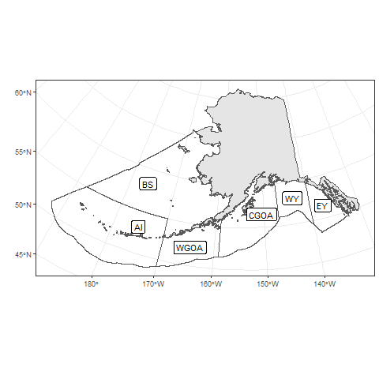

# Appendix : Observer coverage report 

## Introduction
This report summarizes the fishery-dependent data observer data that are available and inform the Gulf of Alaska (GOA) and Bering Sea/Aleutian Islands (BSAI) ‘r doc_name’ stock assessment. 
Logbook, eLandings and fish ticket data are not included here. 
The format of this report is under development and should be considered a draft. 
Data are queried from the Alaska Regional Office Catch Accounting System (CAS) and queried through AKFIN. 
The results are based on total catch estimates and observer deployment information. 
Due to minor differences in observer strata assignments between CAS and what vessels log into the Observer Declare and Deploy System the total catch estimates may be slightly different from those values reported in the North Pacific Observer Program Annual Reports. 
Any differences are expected to be minor. 
Data prior to the 2013 Observer Program Restructure are not included in the analyses presented here due to structural changes in the North Pacific Observer Program.

## Observer Deployment Performance
This section summarizes the projected and realized observer coverage rates since 2016 for all partial coverage trips (i.e., not specific to any fishery). 
Observer strata are defined in the North Pacific Observer Program Annual Reports as follows: Full Coverage - catcher/processors (with limited exceptions), motherships, catcher vessels that are participating in programs that have transferable prohibited species catch, catcher vessels using trawl gear that have requested full coverage for all fishing activity within the BSAI and inshore processors receiving or processing Bering Sea pollock. Partial Coverage - Catcher vessels fishing in federally managed groundfish or parallel fisheries, excepting when in full coverage, catcher vessels participating in the Pacific halibut or sablefish IFQ fisheries, catcher vessels participating in the CDQ fisheries or those < 46ft LOA using hook-and-line gear for groundfish, catch/processors that qualify for partial coverage; and shoreside or stationary floating processors that are not in the full coverage category. 
No Coverage/Selection - vessels < 40ft LOA, jig and exempted vessels
There are two Electronic Monitoring (EM) programs in effect: fixed-gear EM and trawl EM. 
The fixed-gear EM program includes both pot and hook-and-line vessels. 
Trips logged into ODDS for that program have a partial coverage selection rate, and if selected, the vessel must run the EM cameras for the trip duration. 
After the videos are submitted, 30% of recorded hauls are reviewed and catch is fully censused. 
There are no biological samples collected from fixed-gear EM trips. 
Vessels operating in the trawl EM program record all trips and all of the videos are reviewed, however, the review is for compliance monitoring only. 
Vessels operating in the trawl EM program are required to retain all catch (with limited exceptions) for shoreside sampling by observers at the plant.
For 2013 - 2015, the North Pacific Observer Program deployment strata included vessel level selection criteria and coverage rates are not comparable to current time series, therefore, not included in the table below. 
Full Selection trips are all assumed to be 100% covered and not reported in the table below. 
The Zero Selection trips are also not included. 
Values are from the Annual Deployment Plans and the Annual Reports, available on the NPFMC website. 
Not all observer strata were covered each year. 
For example, Hook-and-line (HAL) tender was only covered in 2017, in which a total of four trips were made and thus deemed not a useful strata to include. 
In 2020, observer sampling was significantly impacted March-June due to the pandemic, resulting in minimal coverage during those months and reducing the annual realized coverage rates. 
The trawl EM EFP went into effect in 2020, in this strata all trips have 100% of video reviewed for compliance monitoring, and full retention is in effect. 
Observer sampling occurs shoreside with the target of all Trawl EM EFP deliveries being observer sampled in the BSAI and 30% in the GOA. 
The below table only documents partial coverage rates.

![`r paste0("Figure 3. ",params$name_cap," catch in each observer coverage category in the Observer Deploy and Declare System (ODDS), including fixed gear electronic monitoring (EM). This catch was not necessarily observed. Gear types include pelagic trawl (PTR), non-pelagic trawl (NPT), Pot (POT), or Hook and Line (HAL). Areas include the Aleutian Islands (AI), Bering Sea (BS), Western Gulf of Alaska (WGOA), Central Gulf of Alaska (CGOA), West Yakutat (WY), and East Yakutat (EY). Jig gear is excluded.")`](man/figures/fig3-1.png)

